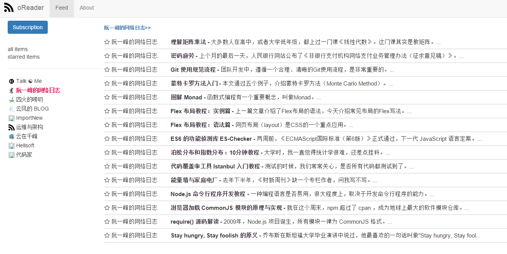

# oReader

a online rss reader build with flask and angularjs, ui refer to [goread](https://www.goread.io), and deploy on heroku

## install

    pip install -r requirements.txt

## run
    python manage.py runserver
